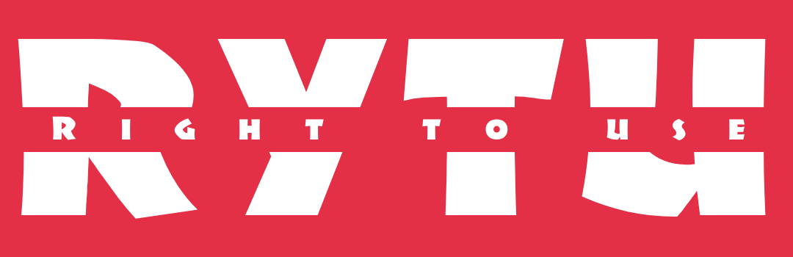

# Right-to-Use-Core

<a name="readme-top"></a>

<br />
<div align="center">
  <a href="https://github.com/codeEzzy/lightlink">
    
  </a>

  <h3 align="center">The Right to Use (RYTU)</h3>

</div>

Welcome to the RYTU Core Repository, which contains the essential components of the RYTU platform, enabling seamless minting, management, and trading of content rights through NFTs. This repository is organized into three main components:

- RYTU-Frontend: The user-facing interface for interaction.
- RYTU-Backend: Handles API requests, business logic, and data orchestration.
- RYTU-Contract: Solidity-based smart contracts that implement the marketplace's logic. This is deployed on XRPL EVM Sidechain

## Repository Structure
```
RYTU-Core/
├── rytu-frontend/
│   ├── src/
│   ├── public/
│   ├── package.json
│   ├── README.md
├── rytu-backend/
│   ├── dist/
│   ├── src/
│   ├── package.json
│   ├── README.md
├── rytu-contract/
│   ├── docs/
    ├── lib/
    ├── script/
│   ├── src/
│   ├── test/
│   ├── foundary.toml
│   ├── README.md
└── README.md
```


## RYTU-Frontend
Description
The frontend is built using React.js, Nextjs, Typescript, Graphql and styled with Tailwind CSS, providing a seamless user experience for minting, managing, and trading RYTU NFTs.

Key Features
- Seamless onboarding and Wallet integration (XRP Ledger).
- Minting and verify ownership interface.
- Create Rytu 
- Request Rytu
- Verification certification
- Explore marketplace

#### Installation Instructions
 - Git clone the repository
 - Navigate to the ```rytu-frontend directory```
 ```
 bash

 cd rytu-frontend
 ```
 - Install dependencies:
```
npm install or yarn install
```

- Start the development server:
```
npm start

```

### Fronted code located in:
[Click to view](https://github.com/Dynamic-Flakes/rytu-frontend)

### RYTU-Backend
Description:
The backend is powered by Node.js, Graphql and Express.js, responsible for handling API requests, transaction validation, and integration with the XRPL.

#### Key Features
- API for querying NFT metadata and marketplace transactions.
- Authentication and user management.
- Analytics and reporting on NFT activity.

#### Installation Instructions
- Git clone the repository
- Navigate to the rytu-backend directory:
```
cd rytu-backend
```
- Install dependencies:
```
npm install or yarn install
```
- Start the server:
```
npm start or yarn start
```
# Backend code located in:
[Click to view](https://github.com/Dynamic-Flakes/rytu-backend)

### RYTU-Contract
Description
The smart contract layer implements the core RYTU NFT marketplace logic, deployed on the XRPL EVM Sidechain.

#### Key Features
- Minting ERC-721 and ERC-1155 NFTs.
- Royalty distribution and fractional ownership.
- Auction and bidding mechanisms.

##### Compilation and Deployment
- Git clone the repository
- Foundry: Install it by running:
```
curl -L https://foundry.paradigm.xyz | bash
foundryup
```
- Navigate to the rytu-contract directory:
```
cd rytu-contract
```
- Build the contract to generate the ABI and bytecode in the out/ directory.

```
forge build
```
- Deployment : 

  - Configuration: Ensure the deployment environment variables are set in a .env file:
  ```
  RPC_URL="https://your-network-rpc-url"
  PRIVATE_KEY="your-private-key"

  ```
  - Script Execution: Use a prewritten deployment script in the script/ directory. Example:
  ```
  forge script script/Deploy.s.sol --rpc-url $RPC_URL --private-key $PRIVATE_KEY --broadcast
  ```
  - Verify deployment
  ```
  forge verify-contract <contract_address> <source_file> --chain-id <sidechain_chain_id> --etherscan-api-key <api_key>
  ```
 
#### Smart contracts code located in:
 [Click to view](https://github.com/Dynamic-Flakes/rytu-contract)

### Roadmap
- Phase 1: Complete the MVP and deploy core functionality on XRPL EVM Sidechain (0-3 months).
- Phase 2: Add advanced features (fractional ownership, auctions, gamification) (3-6 months).
- Phase 3: Scale the marketplace and integrate sustainability incentives (6-12 months).
